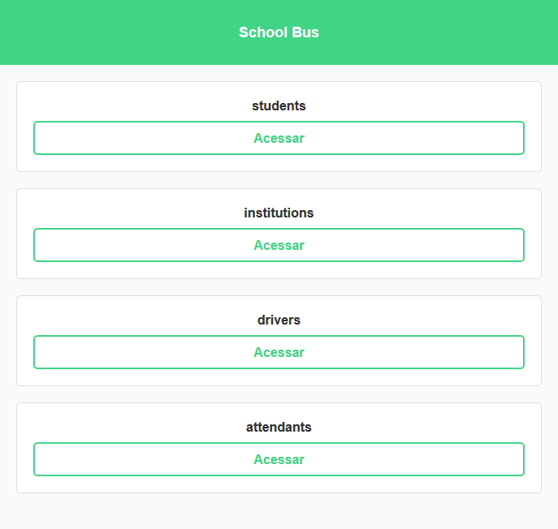

<h2 align='center'>
    Projeto de P2/LP2
</h2>

<h1 align='center'>
    School Bus
</h1>

Projeto para auxiliar o acesso às informações sobre os envolvidos no transporte escolar

# Índice
  * [Membros da equipe](#membros)
  * [Projeto](#projeto)
  * [Tecnologias](#tecnologias)
  * [Requisitos](#requisitos)
  * [Tutorial](#tutorial)

# Membros
  * [Adriel Wanderson](https://github.com/adrielwanderson)
  * [Jailson Soares](https://github.com/jailsonsf)

# Projeto
**O que é?**
    É um sitema para auxiliar o transporte escolar

**O que faz?**
    Faz requisições para a [API](https://github.com/jailsonsf/School-Bus/tree/master/api/schoolbus) para buscar as informções disponíveis sobre estudantes, instituições, motoristas e atendentes.

**Qual problema ele soluciona?**
    Tenta facilitar a maneira com a qual o usuário acessa as informações sobre aqueles que utilizam o transporte escolar e sobre aquelas que trabalham para manter o transporte em funcionamento




# Tecnologias
  * [Spring boot](https://spring.io/)
  * [React js](https://reactjs.org/)

# Requisitos
  * [Spring boot](https://spring.io/)
  * [Maven](https://maven.apache.org/)
  * [Node js](https://nodejs.org/)
  * [Yarn](https://yarnpkg.com/)
  * [React js](https://reactjs.org/)

# Tutorial
  Para iniciar temos que fazer o dowload do projeto
  * Clone o projeto:
  ``` shell
    git clone https://github.com/jailsonsf/School-Bus.git
  ```
  * Ou faça download do zip

  Com o projeto na sua máquina agora vamos executar a [API](https://github.com/jailsonsf/School-Bus/tree/master/api/schoolbus)
  * Para iniciar, na raiz do projecto use o comando:
  ``` shell
    cd api
  ```
  * E em seguida:
  ``` shell
    mvn package && java -jar target/gs-spring-boot-0.1.0.jar
  ```

  Com a API rodando, agora precisamos prepara o [App](https://github.com/jailsonsf/School-Bus/tree/master/app)
  * Para iniciar o app, na raiz do projeto use o comando:
  ``` shell
    cd app
  ```
  * E agora instale as depêndencias usando:
  ``` shell
    yarn
  ```
  * Ou
  ``` shell
    yarn install
  ```
  Agora com as depêndencias devidamente instaladas vamos iniciar a aplicação usando o comando:
  ``` shell
    yarn start
  ```